# TelerikKendoDemo


> **GitHub portföy referans projesi** — Kurumsal yazılım geliştirme yaklaşımını, **Telerik UI for ASP.NET Core** kullanımını, **PostgreSQL** entegrasyonunu, **multi-tenant** mimariyi ve **Clean Architecture** prensiplerini uçtan uca sergilemek amacıyla geliştirilmiş açık kaynak bir İnsan Kaynakları yönetim uygulamasıdır.

ASP.NET Core 8 MVC, Entity Framework Core, FluentValidation, Serilog ve Telerik Kendo UI bileşenleri ile inşa edilmiş; yalnızca çalışan bir demo değil, gerçek kurumsal SaaS senaryolarına yakın bir referans kod tabanı sunar.

---

## Öne Çıkan Özellikler

- ASP.NET Core 8 MVC
- Clean Architecture
- Multi Tenant Yapı
- PostgreSQL
- Entity Framework Core
- Telerik UI for ASP.NET Core
- Kendo Grid
- Kendo Scheduler
- Kendo TreeView
- Kendo Chart
- Docker Destekli Geliştirme Ortamı
- FluentValidation
- Serilog
- Unit Test Altyapısı

---

## Proje Hakkında

TelerikKendoDemo, kurumsal SaaS mantığında çok firmalı (multi-tenant) bir İK yönetim platformunu örnekler. Katmanlı mimari, SOLID prensipleri, merkezi hata yönetimi ve modern .NET ekosistemi bir arada değerlendirilebilir.

**Uygulama modülleri:**

| Modül | Açıklama |
|-------|----------|
| **Dashboard** | Özet metrikler, grafikler ve performans göstergeleri |
| **Personel Yönetimi** | Grid tabanlı CRUD, fotoğraf yükleme, yetkinlik ataması |
| **Departman Yönetimi** | Hiyerarşik TreeView yapısı |
| **İzin Yönetimi** | Scheduler tabanlı izin takvimi |

Tüm kullanıcı arayüzü Türkçedir.

---

## Ekran Görüntüleri

### Dashboard

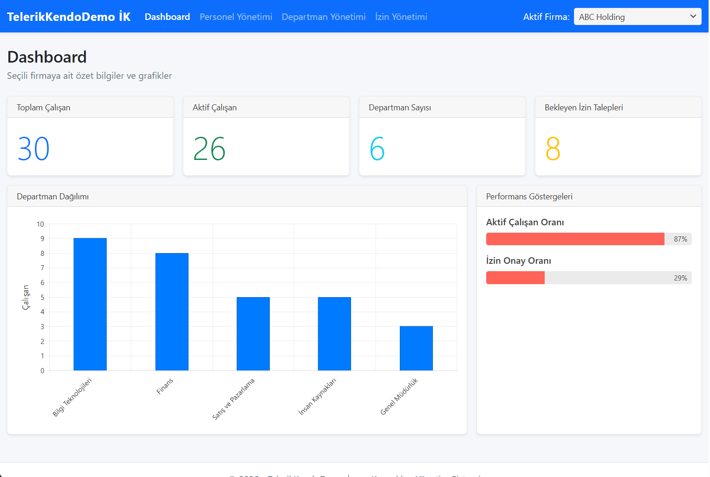

Toplam ve aktif çalışan sayıları, departman dağılım grafiği (Kendo Chart) ve ProgressBar ile oran göstergeleri.

---

### Personel Yönetimi

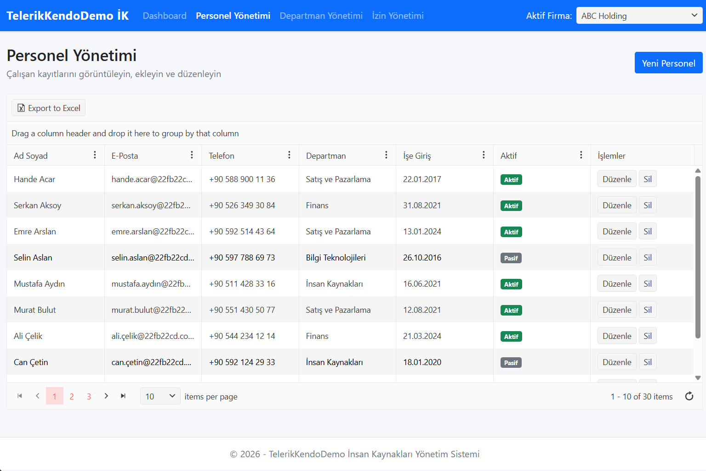

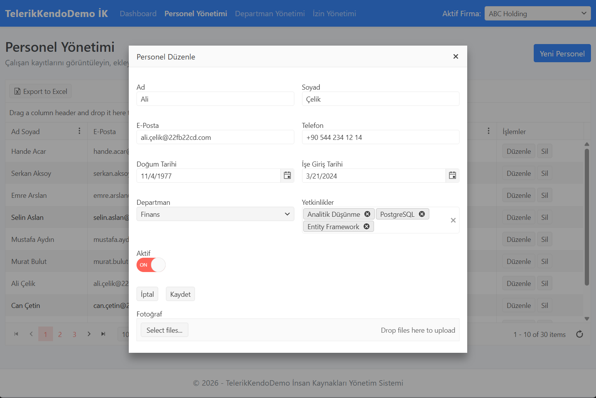

Kendo Grid ile listeleme, Window içinde ekleme/düzenleme, MultiSelect ile yetkinlik atama ve Upload ile fotoğraf yükleme.

---

### Departman Yönetimi

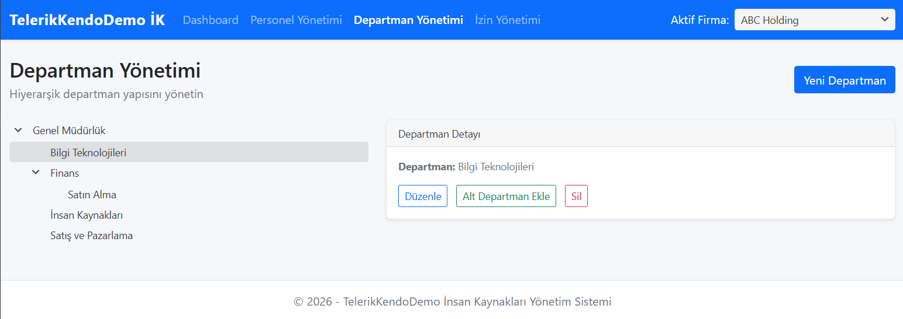

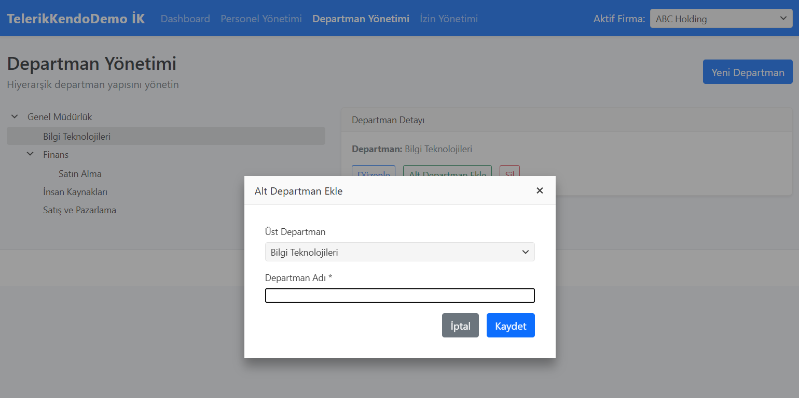

TreeView ile hiyerarşik departman yapısı, alt departman desteği ve firma bazlı filtreleme.

---

### İzin Yönetimi (Scheduler)

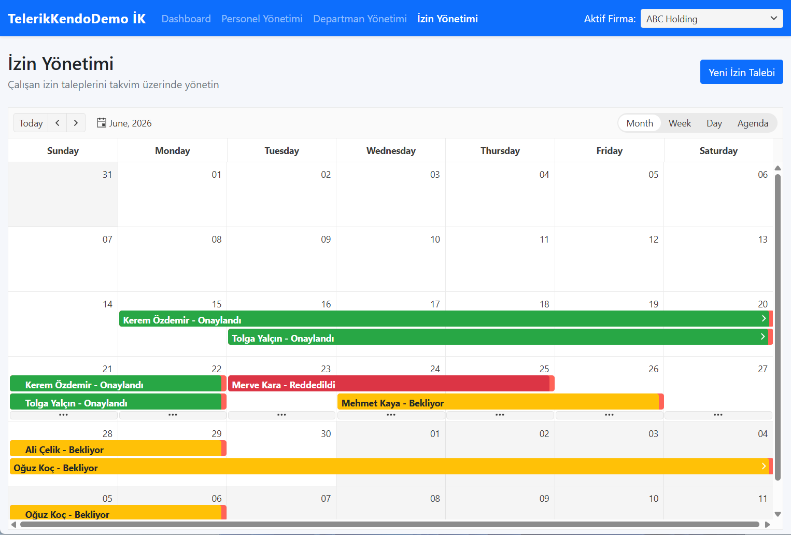

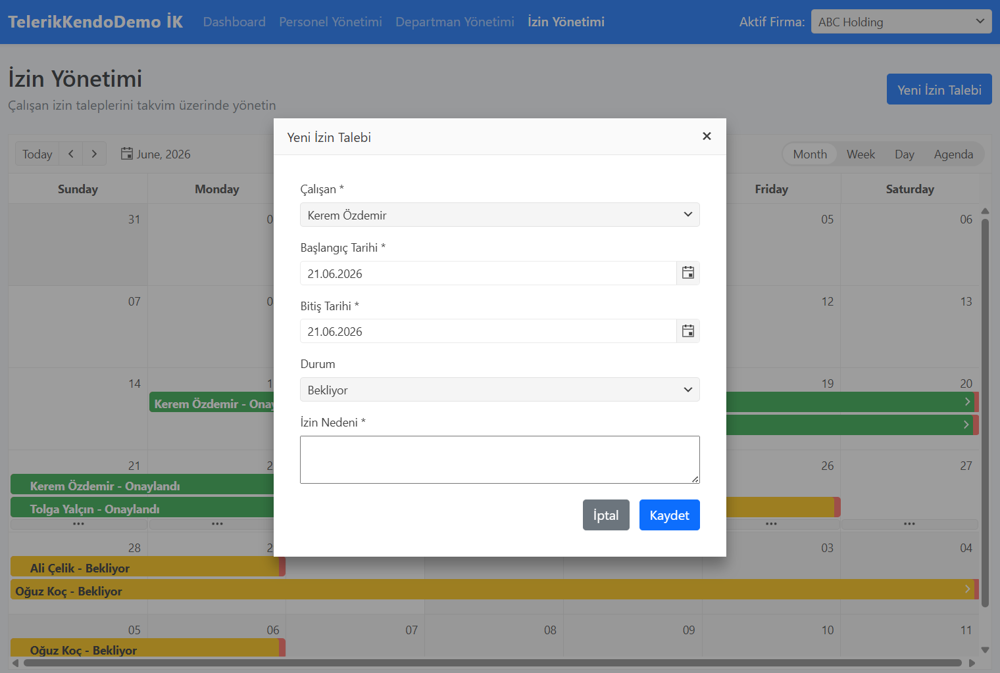

Kendo Scheduler ile takvim görünümü; Bekliyor / Onaylandı / Reddedildi durumları ve izin oluşturma/düzenleme.

---

### Firma Seçimi (Multi-Tenant)

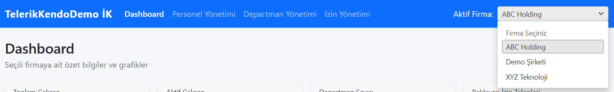

Üst menüdeki Kendo DropDownList ile aktif firma seçimi; tüm ekranlar seçili firmaya göre filtrelenir.

---

## Kullanılan Teknolojiler

| Teknoloji | Açıklama |
|-----------|----------|
| ASP.NET Core 8 MVC | Web katmanı ve sunum |
| PostgreSQL | İlişkisel veritabanı |
| Entity Framework Core 8 | ORM ve migration desteği |
| Telerik Kendo UI | Grid, Chart, Scheduler, TreeView ve diğer bileşenler |
| FluentValidation | Uygulama katmanı doğrulama |
| Serilog | Yapılandırılmış loglama |
| xUnit | Birim testler |
| Docker Compose | PostgreSQL ve pgAdmin geliştirme ortamı |

---

## Mimari Yapı

Proje **Clean Architecture** prensiplerine göre organize edilmiştir. Bağımlılıklar içe doğru akar; Domain katmanı hiçbir dış bağımlılık taşımaz.

```
TelerikKendoDemo.sln
src/
  TelerikKendoDemo.Domain/
  TelerikKendoDemo.Application/
  TelerikKendoDemo.Persistence/
  TelerikKendoDemo.Web/
tests/
  TelerikKendoDemo.Tests/
```

### Clean Architecture — Katman Akışı

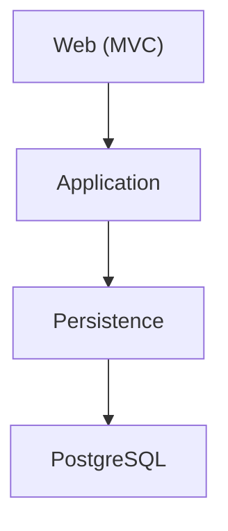

### Katmanlar Arası Bağımlılık

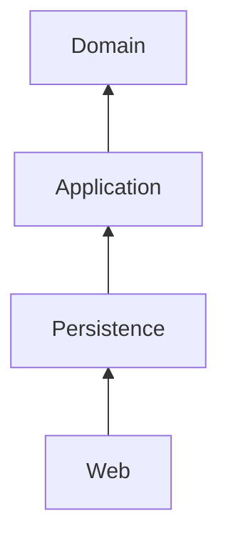

### Multi-Tenant Veri Akışı

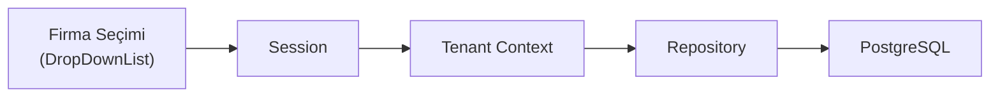

---

## Katmanlar

### Domain

- Entity tanımları (`Tenant`, `Department`, `Employee`, `Skill`, `LeaveRequest`)
- `BaseEntity`, `ITenantEntity`
- Repository ve Unit of Work arayüzleri

### Application

- DTO modelleri
- Servis arayüzleri ve implementasyonları
- FluentValidation kuralları
- `ITenantContext` ile tenant bağlamı

### Persistence

- `ApplicationDbContext`
- Fluent API entity konfigürasyonları
- Generic `Repository<T>` ve `UnitOfWork`
- Migration ve seed data

### Web

- MVC Controller ve View katmanı
- Global exception middleware
- Session tabanlı tenant seçimi
- Kendo UI bileşen entegrasyonu

---

## Multi Tenant Yapısı

Proje **Shared Database** yaklaşımını kullanır. Tüm firmalar aynı veritabanını paylaşır; iş verileri `TenantId` ile ayrılır.

**Örnek firmalar:**

- ABC Holding (varsayılan)
- XYZ Teknoloji
- Demo Şirketi

Firma seçimi üst menüdeki **DropDownList** ile yapılır. Seçim oturum süresince saklanır. Tüm grid, grafik ve raporlar yalnızca seçili firmanın verilerini gösterir.

---

## PostgreSQL Kurulumu (Docker — Önerilen)

Proje kök dizinindeki `docker-compose.yml` dosyası PostgreSQL ve pgAdmin servislerini birlikte ayağa kaldırır.

### Gereksinimler

- [Docker Desktop](https://www.docker.com/products/docker-desktop/) (veya Docker Engine + Docker Compose)

### Servisleri Başlatma

Proje kök dizininde:

```bash
docker compose up -d
```

Durum kontrolü:

```bash
docker compose ps
```

Servisleri durdurmak için:

```bash
docker compose down
```

### Docker Servisleri

| Servis | Container | Port | Açıklama |
|--------|-----------|------|----------|
| PostgreSQL 17 | `telerik-kendo-demo-postgres` | `5432` | Uygulama veritabanı |
| pgAdmin 4 | `telerik-kendo-demo-pgadmin` | `5050` | Web tabanlı veritabanı yönetimi |

### Bağlantı Bilgileri

`docker-compose.yml` ile oluşturulan varsayılan değerler:

| Ayar | Değer |
|------|-------|
| Host | `localhost` |
| Port | `5432` |
| Veritabanı | `TelerikKendoDemoDb` |
| Kullanıcı | `postgres` |
| Şifre | `postgres` |

`src/TelerikKendoDemo.Web/appsettings.json` dosyası bu değerlerle uyumludur:

```json
"ConnectionStrings": {
  "DefaultConnection": "Host=localhost;Port=5432;Database=TelerikKendoDemoDb;Username=postgres;Password=postgres"
}
```

Veritabanı adını veya kimlik bilgilerini değiştirirseniz hem `docker-compose.yml` hem de `appsettings.json` dosyalarını birlikte güncelleyin.

### pgAdmin ile Veritabanı Yönetimi

1. Tarayıcıda **http://localhost:5050** adresine gidin.
2. Giriş bilgileri (`docker-compose.yml` içinden):

| Alan | Değer |
|------|-------|
| E-posta | `admin@admin.com` |
| Şifre | `admin` |

3. Giriş yaptıktan sonra sol panelde **TelerikKendoDemo** sunucusu otomatik görünür (`docker/pgadmin/servers.json`). İlk bağlantıda yalnızca şifre sorulur: **`postgres`**

Manuel sunucu eklemeniz gerekirse **Register → Server** kullanın:

| Sekme / Alan | Değer |
|--------------|-------|
| General → Name | `TelerikKendoDemo` (isteğe bağlı) |
| Connection → Host | `postgres` |
| Connection → Port | `5432` |
| Connection → Database | `TelerikKendoDemoDb` |
| Connection → Username | `postgres` |
| Connection → Password | `postgres` |

> **Önemli — `localhost` kullanmayın:** pgAdmin tarayıcıda çalışsa da arka planda Docker container içindedir. `localhost` veya `127.0.0.1` pgAdmin container'ının kendisine işaret eder, PostgreSQL'e değil. Bu durumda *Connection refused* hatası alırsınız. Host alanına **`postgres`** yazın (Docker Compose servis adı).

> **pgAdmin giriş bilgisi değişikliği:** `PGADMIN_DEFAULT_EMAIL` ve `PGADMIN_DEFAULT_PASSWORD` yalnızca ilk kurulumda geçerlidir. Değişiklik sonrası giriş yapamıyorsanız pgAdmin volume'unu sıfırlayın:
>
> ```bash
> docker compose stop pgadmin
> docker compose rm -f pgadmin
> docker volume rm telerik-kendo-demo_pgadmin_data
> docker compose up -d pgadmin
> ```

### Kalıcı Veri (Volumes)

| Volume | İçerik |
|--------|--------|
| `postgres_data` | PostgreSQL veritabanı dosyaları |
| `pgadmin_data` | pgAdmin ayarları ve kayıtlı sunucular |

Volume'ları da silmek için (tüm veritabanı verisi silinir):

```bash
docker compose down -v
```

### Yerel PostgreSQL Kurulumu (Alternatif)

Docker kullanmak istemiyorsanız PostgreSQL 14+ kurup veritabanını manuel oluşturabilirsiniz:

```sql
CREATE DATABASE "TelerikKendoDemoDb";
```

Ardından `appsettings.json` içindeki bağlantı dizesini kendi ortamınıza göre düzenleyin.

---

## Migration İşlemleri

Proje Entity Framework Core migration desteği ile gelir. Migration dosyaları `src/TelerikKendoDemo.Persistence/Migrations` klasöründe yer alır.

### Ön Koşullar

1. PostgreSQL servisinin çalışıyor olması (`docker compose up -d`)
2. EF Core CLI aracının yüklü olması:

```bash
dotnet tool install --global dotnet-ef
```

### Migration Uygulama

Proje kök dizininde:

```bash
dotnet ef database update --project src/TelerikKendoDemo.Persistence --startup-project src/TelerikKendoDemo.Web
```

Başarılı olduğunda aşağıdaki tablolar oluşturulur:

- `Tenants`
- `Departments`
- `Employees`
- `Skills`
- `EmployeeSkills`
- `LeaveRequests`
- `__EFMigrationsHistory`

### Otomatik Migration ve Seed

Uygulama başlatıldığında (`Program.cs`) migration otomatik uygulanır ve veritabanı boşsa seed data yüklenir. Bu nedenle migration'ı elle çalıştırmadan da uygulamayı başlatabilirsiniz; ancak geliştirme ortamında migration durumunu kontrol etmek için `dotnet ef database update` komutunu kullanmanız önerilir.

### Yeni Migration Oluşturma

Entity veya konfigürasyon değişikliği sonrası:

```bash
dotnet ef migrations add MigrationAdi --project src/TelerikKendoDemo.Persistence --startup-project src/TelerikKendoDemo.Web --output-dir Migrations
```

Migration'ı veritabanına uygulamak için tekrar `database update` komutunu çalıştırın.

### Migration Geri Alma

Son migration'ı kaldırmak için:

```bash
dotnet ef migrations remove --project src/TelerikKendoDemo.Persistence --startup-project src/TelerikKendoDemo.Web
```

> **Uyarı:** `migrations remove` yalnızca henüz veritabanına uygulanmamış migration'lar için güvenlidir. Uygulanmış migration'lar için veritabanını yedekleyip dikkatli ilerleyin.

### Migration Durumunu Kontrol Etme

```bash
dotnet ef migrations list --project src/TelerikKendoDemo.Persistence --startup-project src/TelerikKendoDemo.Web
```

---

## Telerik Bileşenleri

Projede aşağıdaki Kendo UI bileşenleri kullanılmaktadır:

| Bileşen | Kullanım Alanı |
|---------|----------------|
| Kendo Grid | Personel listesi, paging, sorting, filtering, grouping, Excel export |
| Kendo Window | Personel ve departman formları |
| Kendo MultiSelect | Çalışan yetkinlik seçimi |
| Kendo Upload | Personel fotoğraf yükleme |
| Kendo Notification | CRUD işlem bildirimleri |
| Kendo DropDownList | Firma ve form seçimleri |
| Kendo Chart | Dashboard departman dağılımı |
| Kendo Card | Dashboard özet kartları |
| Kendo TileLayout | Dashboard düzeni |
| Kendo ProgressBar | Aktif çalışan ve izin onay oranları |
| Kendo TreeView | Hiyerarşik departman yapısı |
| Kendo Scheduler | İzin takvimi |

### Telerik UI for ASP.NET Core Kurulumu

Proje **Telerik UI for ASP.NET Core** NuGet paketini ve yerel Kendo script/stil dosyalarını kullanır; CDN kullanılmaz.

**NuGet paketleri** (`TelerikKendoDemo.Web`):

- `Telerik.UI.for.AspNet.Core` (2026.2.520)
- `Telerik.Licensing`

Yerel Telerik kurulumunuzdan paketler `nuget.config` içindeki `telerik-local` kaynağı üzerinden çözülür:

```
C:\Program Files (x86)\Progress\Telerik UI for ASP.NET Core 2026 Q2\wrappers\aspnetcore\Binaries\AspNet.Core
```

**Client-side dosyalar** (`wwwroot/lib/kendo/`) Telerik kurulum klasöründen kopyalanmıştır:

| Dosya | Kaynak |
|-------|--------|
| `js/kendo.all.min.js` | `...\2026 Q2\js\` |
| `js/kendo.aspnetmvc.min.js` | `...\2026 Q2\js\` |
| `css/default-main.css` | `...\2026 Q2\styles\` |
| `css/font-icons/` | `...\2026 Q2\styles\font-icons\` |

Telerik sürümünü güncelledikten sonra bu dosyaları yeniden kopyalamanız gerekir.

**Program.cs** içinde `builder.Services.AddKendo()` tanımlıdır. View'larda `@addTagHelper *, Kendo.Mvc` ve `@Html.Kendo().DeferredScriptFile()` kullanılır.

Kendo JS dosyaları CDN yerine `wwwroot/lib/kendo/` altından manuel yüklendiği için `_Layout.cshtml` içinde `@Html.Kendo().ActivateKendoScripts()` çağrısı gerekir. Bu satır, tarayıcı tarafındaki `License key missing for Kendo UI` uyarısını kaldırır. Kendo script referanslarının hemen ardından yer almalıdır.

### Deneme Lisansını Aktifleştirme

Projede `Telerik.Licensing` paketi build sırasında lisans dosyasını otomatik arar. **Doğru ürün için indirilmiş** `telerik-license.txt` dosyası gerekir (ASP.NET Core → `UIASPCORE`).

**Önemli:** Telerik hesabından indirilen lisans dosyası **Telerik UI for ASP.NET Core** ürününü içermelidir. Yalnızca ASP.NET AJAX (`RCAJAX`) içeren dosyalar bu projede çalışmaz.

#### Lisans dosyasını nereye koymalı?

Aşağıdaki konumlardan **birine** kopyalayın (dosya adı tam olarak `telerik-license.txt` olmalı):

| Konum | Kapsam |
|-------|--------|
| `src/TelerikKendoDemo.Web/telerik-license.txt` | Yalnızca bu proje |
| `%AppData%\Telerik\telerik-license.txt` | Tüm projeler (makine geneli) |

PowerShell örneği (proje için):

```powershell
Copy-Item "C:\Users\Melih\Downloads\telerik-license.txt" `
  "src\TelerikKendoDemo.Web\telerik-license.txt"
```

#### Doğru lisans dosyasını alma

1. [Telerik Hesabım → Lisanslar](https://www.telerik.com/account/your-licenses) sayfasına gidin
2. **Telerik UI for ASP.NET Core** ürününü seçin
3. **License Key** / `telerik-license.txt` indirin

Alternatif: **Progress Control Panel** (Başlat menüsü) → **Telerik UI for ASP.NET Core 2026 Q2** → deneme/lisans yönetimi → lisans dosyası `%AppData%\Telerik\` altına yazılır.

#### Doğrulama

Projeyi yeniden derleyin:

```powershell
dotnet build src/TelerikKendoDemo.Web
```

Başarılı lisans mesajı:

```
License OK for "Telerik UI for ASP.NET Core" (UIASPCORE) ... Trial, valid until ...
```

Hata görürseniz (`TKL101: ... is not listed in your current license file`) indirdiğiniz dosya yanlış ürün içindir; ASP.NET Core lisansını tekrar indirin.

> `telerik-license.txt` kişisel lisans anahtınızı içerir; `.gitignore` ile repoya eklenmez.

Yeni bir makinede geliştirme ortamı kurarken:

1. [Telerik UI for ASP.NET Core](https://www.telerik.com/aspnet-core-ui) Windows kurulumunu yapın
2. `dotnet restore` ile NuGet paketlerini çekin
3. Kendo JS/CSS dosyalarını yukarıdaki kaynak klasörden `wwwroot/lib/kendo/` altına kopyalayın

---

## Clean Code Yaklaşımı

- Anlamlı sınıf, metod ve değişken isimlendirme
- Tek sorumluluk ilkesine uygun küçük servisler
- DTO ile entity ayrımı
- Tekrarlayan kodun mapping ve generic repository ile azaltılması
- Async/await ile non-blocking veri erişimi
- Nullable Reference Types aktif
- Global exception middleware ile merkezi hata yönetimi
- FluentValidation ile ayrıştırılmış doğrulama katmanı
- Serilog ile yapılandırılmış loglama

---

## SOLID Prensipleri

| Prensip | Uygulama |
|---------|----------|
| **S** — Single Responsibility | Her servis tek bir iş alanından sorumlu (`EmployeeService`, `DepartmentService`) |
| **O** — Open/Closed | Generic repository ve arayüzler genişletmeye açık |
| **L** — Liskov Substitution | `IRepository<T>` implementasyonları birbirinin yerine kullanılabilir |
| **I** — Interface Segregation | Küçük, odaklı servis arayüzleri |
| **D** — Dependency Inversion | Web katmanı somut sınıflara değil arayüzlere bağımlı |

---

## Çalıştırma

1. PostgreSQL servislerini başlatın:

```bash
docker compose up -d
```

2. Migration'ı uygulayın (isteğe bağlı — uygulama başlangıcında da otomatik uygulanır):

```bash
dotnet ef database update --project src/TelerikKendoDemo.Persistence --startup-project src/TelerikKendoDemo.Web
```

3. Uygulamayı çalıştırın:

```bash
dotnet restore
dotnet build
dotnet run --project src/TelerikKendoDemo.Web
```

Tarayıcıda `https://localhost:5xxx` adresine gidin. Varsayılan firma **ABC Holding** olarak yüklenir.

---

## Seed Data

Her firma için otomatik oluşturulan veriler:

- 5 departman (hiyerarşik)
- 10 yetkinlik
- 30 çalışan
- 20 izin kaydı

---

## Test Altyapısı

Bu proje referans uygulama amacıyla geliştirildiği için kapsamlı test senaryoları yerine mimari yapı ve entegrasyon örnekleri ön planda tutulmuştur. Buna rağmen test altyapısı hazırlanmış olup servis katmanı için birim testleri genişletilmeye uygundur.

**Mevcut test kapsamı** (`tests/TelerikKendoDemo.Tests`):

| Test | Kapsam |
|------|--------|
| `Gecersiz_Email_Dogrulama_Hatasi_Vermeli` | FluentValidation — e-posta doğrulama |
| `EntityMapper_LeaveRequest_Durum_Metnini_Dogru_Donmeli` | Entity → DTO mapping |

Testleri çalıştırmak için:

```bash
dotnet test
```

---

## Gelecek Geliştirmeler (Yol Haritası)

> **Önemli:** Aşağıdaki maddeler **henüz kod tabanında uygulanmamıştır.** Bu bölüm, referans projenin mevcut kapsamının ötesinde düşünülen olası adımları listeler. Öncelik sırası ve kapsam, projenin evrilmesine göre değişebilir; taahhüt niteliği taşımaz.

Proje şu an **çok firmalı veri izolasyonu, CRUD modülleri, Telerik UI entegrasyonu ve Clean Architecture iskeleti** ile çalışır durumdadır. Yol haritası, bu temeli kurumsal üretim ortamına daha da yaklaştırmayı hedefler.

### Kısa vadeli planlar

| Özellik | Hedef |
|---------|-------|
| **Kimlik Doğrulama ve Yetkilendirme** | Kullanıcı oturumu, güvenli giriş/çıkış ve korumalı uç noktalar |
| **Rol Bazlı Erişim Kontrolü (RBAC)** | Modül ve işlem bazında yetki ayrımı (ör. yalnızca İK yöneticisi onay) |
| **Audit Log** | Kim, ne zaman, hangi kaydı değiştirdi — izlenebilirlik |
| **Soft Delete** | Silinen kayıtların mantıksal olarak saklanması ve geri getirilebilmesi |

### Orta vadeli planlar

| Özellik | Hedef |
|---------|-------|
| **CQRS** | Okuma ve yazma sorumluluklarının ayrılması; daha ölçeklenebilir servis katmanı |
| **MediatR** | İstek/yanıt deseni ile controller'ların inceltilmesi |
| **API Katmanı** | MVC arayüzüne ek olarak REST API ve olası mobil/entegrasyon tüketicileri |

### Uzun vadeli planlar

| Özellik | Hedef |
|---------|-------|
| **Docker Compose ile Tam Ortam Kurulumu** | Uygulama + veritabanı + yardımcı servislerin tek komutla ayağa kalkması |
| **Kubernetes Deployment Örneği** | Bulut ortamına dağıtım, ölçekleme ve operasyonel referans |

Bu maddelerden birini önceliklendirmek veya katkıda bulunmak isterseniz issue açarak tartışmaya başlayabilirsiniz.
